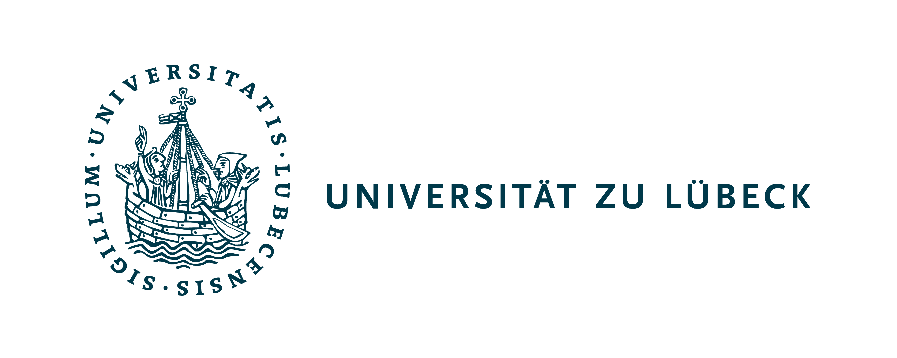

# MIMPC++
_A fast typesafe Mixed Integer Model Predictive Control C++ library_


## Description
Full documentation under: [Documentation](https://dfki-ric-underactuated-lab.github.io/mimpc/)

The library was originally developed as a fast implementation
of an MPC for European Space Agency's [free-floating platform REACSA](https://www.researchgate.net/profile/Gunter-Just/publication/374631799_REACSA_Actuated_Floating_Platform_for_Orbital_Robotic_Concept_Testing_and_Control_Software_Development/links/6527d23161c4044c404e6c7d/REACSA-Actuated-Floating-Platform-for-Orbital-Robotic-Concept-Testing-and-Control-Software-Development.pdf)
which is controlled by a continuous actuated Reaction Wheel and eight binary actuated thrusters under dwell time constraints.


This project contains:
1. The MIMPC __library__ that has been designed to provide a fast MPC for any system that combines continuous and binary actuators under dwell time constraints.
2. A __Simulator__ that provides a simulation based on [Drake toolbox](https://drake.mit.edu/) that simulates the [free-floating platform REACSA](https://www.researchgate.net/profile/Gunter-Just/publication/374631799_REACSA_Actuated_Floating_Platform_for_Orbital_Robotic_Concept_Testing_and_Control_Software_Development/links/6527d23161c4044c404e6c7d/REACSA-Actuated-Floating-Platform-for-Orbital-Robotic-Concept-Testing-and-Control-Software-Development.pdf) controlled by the MPC.
3. __Example__ code [(examples/)](../examples/esa_reacsa/main.cpp) that shows how to use the library together with the simulator.

## Documentation
Full documentation under: [Documentation](https://dfki-ric-underactuated-lab.github.io/mimpc/)
### Installation
Please refer to the [installation instructions](INSTALL.md). 
For simple use a [Dockerfile](Dockerfile) is available. To build and run the container simply run:
```bash
docker build -t mimpc .
```
To directly run the example run:
```bash
docker run -it --init --network="host" mimpc build/reacsamimpc
```
Or simply launch the container and play around:
```bash
docker run -it --network="host" mimpc 
```

(Note that when trying to stop the controller in docker `CTRL+C` might get cought, making it nececarry to press it **5 times** to enforce termination.)
### Usage
#### Run examples
When the simulation and examples have been built, run ```./build/reacsamimpc``` within the repos root folder.
It starts a few tests with the simulated [free-floating platform REACSA](https://www.researchgate.net/profile/Gunter-Just/publication/374631799_REACSA_Actuated_Floating_Platform_for_Orbital_Robotic_Concept_Testing_and_Control_Software_Development/links/6527d23161c4044c404e6c7d/REACSA-Actuated-Floating-Platform-for-Orbital-Robotic-Concept-Testing-and-Control-Software-Development.pdf) and safes the results.
The simulation creates a visualisation that can be rendered by opening (http://localhost:7000) in any browser.


#### Use the library
To get a fully working MIMPC for your own system the system dynamics have to be specified by deriving from @ref mimpc::System.
The library provides next to @ref mimpc::System two main interfaces:
- @ref mimpc::Solver is the low level interface in which the dwell time constraints, the cost function and the system constraints can be specified. 
It also provides the functionality to set the current state, solve the problem and retrieve the optimal solution. 
Currently, the library with @ref mimpc::SCIPSolver only contains one Solver which implements this lowe level interface. It is based on the open source SCIP solver (https://scipopt.org/).
To integrate your favourite solver, derive from @ref mimpc::Solver
- @ref mimpc::MPC is the high level interface which warps a configured mimpc::Solver implementation and wraps the typical MPC control loop into a simpler interface.

## Authors
- [Franek Stark](https://robotik.dfki-bremen.de/de/ueber-uns/mitarbeiter/person/frst03) ([@FranekStark](https://github.com/FranekStark))

Feel free to contact us if you have questions about the library or examples. Enjoy!

## Acknowledgments
The authors would like to thank the support of the projects M-RoCk (Grant No.: FKZ 01IW21002), AAPLE (Grant Number: 50WK2275) and COOPERANTS (Grant No.: 68GX21003H).
Further many thanks to the University of Lübeck and especially the [Institute for Electrical Engineering in Medicine](https://www.ime.uni-luebeck.de/institute), the [Underactuated Robotics Lab](https://robotik.dfki-bremen.de/en/research/research-facilities-labs/underactuated-lab) and [European Space Agencies Orbital Robotics Lab](https://technology.esa.int/lab/automation-and-robotics-laboratories) for the collaboration.


<br/>

<br/>


## License
This work has been released under the BSD 3-Clause License. Details and terms of use are specified in the LICENSE file within this repository. Note that we do not publish third-party software, hence software packages from other developers are released under their very own terms and conditions, e.g. Stable baselines (MIT License) and Tensorflow (Apache License v2.0). If you install third-party software packages along with this repo ensure that you follow each individual license agreement.

## Citation
Please cite one of the following works:

[1] F. Stark, S. Vyas, G. Schildbach, and F. Kirchner, “Linear Model Predictive Control for a planar free-floating platform: A comparison of binary input constraint formulations,” in Proccedings of 17th Symposium on Advanced Space Technologies in Robotics and Automation, Oct. 2023. doi: [10.48550/arXiv.2312.10788.](https://arxiv.org/abs/2312.10788)
```
@inproceedings{stark_linear_2023,
	title = {Linear {Model} {Predictive} {Control} for a planar free-floating platform: {A} comparison of binary input constraint formulations},
	volume = {17},
	copyright = {All rights reserved},
	doi = {10.48550/arXiv.2312.10788},
	booktitle = {Proccedings of 17th {Symposium} on {Advanced} {Space} {Technologies} in {Robotics} and {Automation}},
	author = {Stark, Franek and Vyas, Shubham and Schildbach, Georg and Kirchner, Frank},
	month = oct,
	year = {2023},
}
```
[2] F. Stark, “Model Predictive Control for 3-dof free floating platform with binary actuated thrusters and reaction wheel,” Master Thesis, Univerität zu Lübeck, Lübeck, Germany, 2023.
```
@mastersthesis{stark_model_2023,
	address = {Lübeck, Germany},
	title = {Model {Predictive} {Control} for 3-dof free floating platform with binary actuated thrusters and reaction wheel},
	school = {Univerität zu Lübeck},
	author = {Stark, Franek},
	month = oct,
	year = {2023},
}
```
